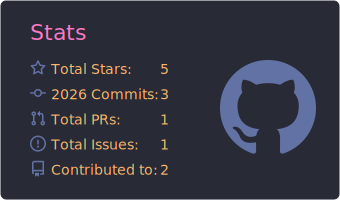
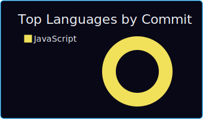
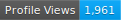

  

<h1 align="center">
  
</h1>

  <strong>Java & Python Programmer || MERN Stack Developer || MongoDB Database || AIML Enthusiast || Patent Holder: "AI-based LPG Gas Leakage Detection & Fire Alert System"</strong>

  
  
  

  
  

  

---

## 🚀 About Me

I am a passionate software developer specializing in building modern web applications using the **MERN Stack** (MongoDB, Express.js, React, Node.js) and designing intelligent systems. I am highly passionate about **Artificial Intelligence & Machine Learning**, constantly exploring deep learning, computer vision, and automated IoT systems.

* 💻 **Core Focus:** Developing full-stack web applications and training deep learning models.
* 🛠️ **MERN Stack Expertise:** Building robust servers with Node.js/Express, managing data with MongoDB, and creating dynamic frontends with React.
* 🧠 **AIML Interest:** Exploring computer vision applications, CNN classification models, and automating routines using Python.
* ⚡ **Fun Fact:** I love writing Python scripts using Computer Vision to automate my daily tasks!

---

## 🛠️ Tech Stack & Skills

<table align="center" width="100%">
  <tr>
    <td valign="top" width="50%">
      <h3>💻 Programming & Backend</h3>
      

        
      

      <ul>
        <li>Core Java & OOP concepts</li>
        <li>Python automation scripting</li>
        <li>Node.js & Express.js REST APIs</li>
        <li>Django backend security & integration</li>
        <li>SQL (MySQL/PostgreSQL) & NoSQL (MongoDB)</li>
      </ul>
    </td>
    <td valign="top" width="50%">
      <h3>🌐 Frontend & Web Design</h3>
      

        
      

      <ul>
        <li>React.js & Next.js SPAs</li>
        <li>Modern HTML5 & CSS3 layout design</li>
        <li>State Management & REST API integrations</li>
        <li>Responsive Web App Architectures</li>
      </ul>
    </td>
  </tr>
  <tr>
    <td valign="top" width="50%">
      <h3>🤖 AI, Machine Learning & CV</h3>
      

        
      

      <ul>
        <li>Computer Vision with OpenCV & PIL</li>
        <li>Facial emotion recognition CNNs</li>
        <li>Data analytics with NumPy & Pandas</li>
        <li>Deep Learning models with TensorFlow</li>
      </ul>
    </td>
    <td valign="top" width="50%">
      <h3>🔧 Developer Tools & OS</h3>
      

        
      

      <ul>
        <li>Git version control & GitHub workflows</li>
        <li>Containerization & deployments with Docker</li>
        <li>OS environments: Ubuntu Linux & Windows</li>
        <li>Modern IDEs: VS Code</li>
      </ul>
    </td>
  </tr>
</table>

---

## 📌 Featured Projects

<table align="center" width="100%">
  <tr>
    <td width="50%" valign="top">
      

        <h3>🛒 <a href="https://github.com/Arghya876/Novacart">NovaCart</a></h3>
        
<em>Premium Full-Stack E-Commerce Platform</em>

        
      

      <ul>
        <li>Secure authentication & Admin dashboard</li>
        <li>Shopping cart & checkout system</li>
        <li>Fully responsive design using modern layout principles</li>
      </ul>
    </td>
    <td width="50%" valign="top">
      

        <h3>🔥 <a href="https://github.com/Arghya876/AI-based-LPG-Gas-Leakage-Detection-Fire-Alert-System">LPG Leakage Alert System</a></h3>
        
<em>AI/IoT Home Safety System</em>

        
      

      <ul>
        <li>Real-time gas leak & fire detection</li>
        <li>Computer vision visual confirmation</li>
        <li>Automated real-time WhatsApp emergency alerts</li>
      </ul>
    </td>
  </tr>
  <tr>
    <td width="50%" valign="top">
      

        <h3>😊 <a href="https://github.com/Arghya876/Face-Emotion-Recognition">Face Emotion Recognition</a></h3>
        
<em>Deep Learning CNN Classifier</em>

        
      

      <ul>
        <li>Live video emotion classification</li>
        <li>Trained Convolutional Neural Network model</li>
        <li>High-accuracy OpenCV frame analytics</li>
      </ul>
    </td>
    <td width="50%" valign="top">
      

        <h3>🚨 <a href="https://github.com/Arghya876/Face-Obstruction-Detection-with-WhatsApp-Alert">Face Obstruction Detector</a></h3>
        
<em>Computer Vision Security Monitor</em>

        
      

      <ul>
        <li>Monitors video feed for face coverings</li>
        <li>Triggers alert if face is hidden >5 seconds</li>
        <li>Automated WhatsApp warning message dispatch</li>
      </ul>
    </td>
  </tr>
</table>

---

## 🏆 Achievements & Highlights

* 🏅 **IoT & Safety Innovation:** Developed an advanced home safety AI system using computer vision & automated alerts.
* 📜 **Patents:** Co-invented and filed a patent for the **AI-based LPG Gas Leakage Detection & Fire Alert System**.
* ⚙️ **Full-Stack Architect:** Created a highly robust, fully interactive MERN-stack e-commerce marketplace (**NovaCart**).
* 🤖 **Deep Learning:** Implemented computer vision neural networks with real-time video analytics capabilities.
* 📚 **Continuous Growth:** Successfully completed assignments and challenges in Web Development, Java concepts, and Django security integration.

---

## 📊 GitHub Analytics

  
  

  

---

## 👾 Contribution Activity Game

  <picture>
    <source media="(prefers-color-scheme: dark)" srcset="https://raw.githubusercontent.com/Arghya876/Arghya876/output/github-contribution-grid-snake-dark.svg" />
    <source media="(prefers-color-scheme: light)" srcset="https://raw.githubusercontent.com/Arghya876/Arghya876/output/github-contribution-grid-snake.svg" />
    
  </picture>

---

  

  <em>Thanks for visiting! Feel free to reach out for collaborations or project discussions.</em>

